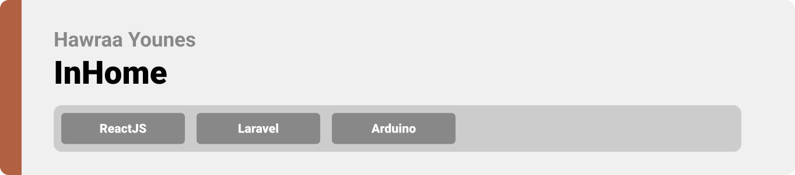
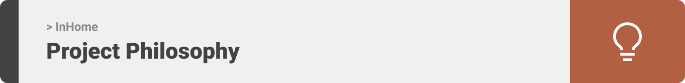
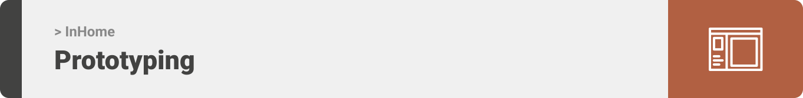
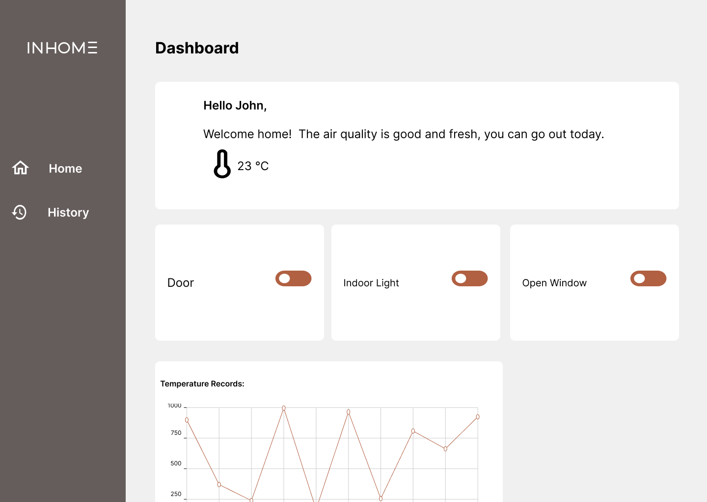
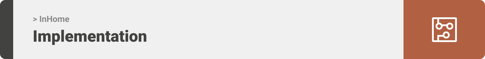

<div align="center">

> Hello world! This is the project’s summary that describes the project plain and simple, limited to the space available. 


**[PROJECT PHILOSOPHY](https://github.com/julescript/well_app#-project-philosophy) • [WIREFRAMES](https://github.com/julescript/well_app#-wireframes) • [TECH STACK](https://github.com/julescript/well_app#-tech-stack) • [IMPLEMENTATION](https://github.com/julescript/well_app#-impplementation) • [HOW TO RUN?](https://github.com/julescript/well_app#-how-to-run)**

</div>

<br><br>




> InHome is a home automation system that  gives you access to control devices in your home from a web page anywhere in the world. 
> 


### User Stories
- As a user, I want to access my home remotely, so that I can control it.
- As a user, I want to save family memories, so that I can see them later
- As a user, I want to have alarm system, so that I can have good security

<br><br>



> This design was planned before on paper, then moved to Figma app for the fine details.
Note that i didn't use any styling library or theme, all from scratch and using pure css modules

| Landing  | Home  |
| -----------------| -----|
|  | |


<br><br>


Here's a brief high-level overview of the tech stack the Well app uses:

- This project uses the [React js library](https://reactjs.org/). React is a free and open-source front-end JavaScript library for building user interfaces based on UI components.
- For persistent storage (database), the app uses the [MySQL](https://www.mysql.com/) which is widely used relational database management system (RDBMS). MySQL is free and open-source. MySQL is ideal for both small and large applications.
- For backend, the project uses [Laravel Framework](https://laravel.com/). Laravel is an open-source PHP framework, which is robust and easy to understand. It follows a model-view-controller design pattern.


<br><br>


> Uing the above mentioned tecch stacks and the wireframes build with figma from the user sotries we have, the implementation of the app is shown as below, these are screenshots from the real app

| Landing  | Home  |
| -----------------| -----|
|  |  |


<br><br>


> This is an example of how you may give instructions on setting up your project locally.
To get a local copy up and running follow these simple example steps.

### Prerequisites

This is an example of how to list things you need to use the software and how to install them.
* npm
  ```sh
  npm install npm@latest -g
  ```

### Installation

_Below is an example of how you can instruct your audience on installing and setting up your app. This template doesn't rely on any external dependencies or services._

1. Clone the repo
   ```sh
   git clone https://github.com/HawraaYounes/home-automation
   ```
2. Install NPM packages
   ```sh
   npm install
   ```
3. Enter your API in `config.js`
   ```js
   const API_KEY = 'ENTER YOUR API';
   ```


